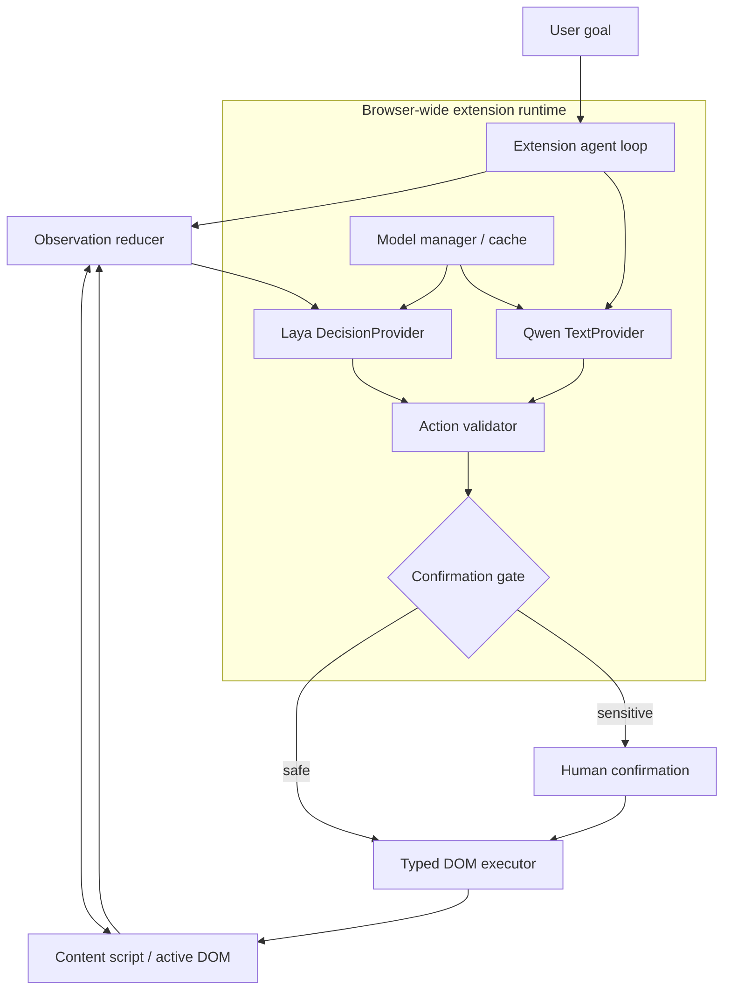
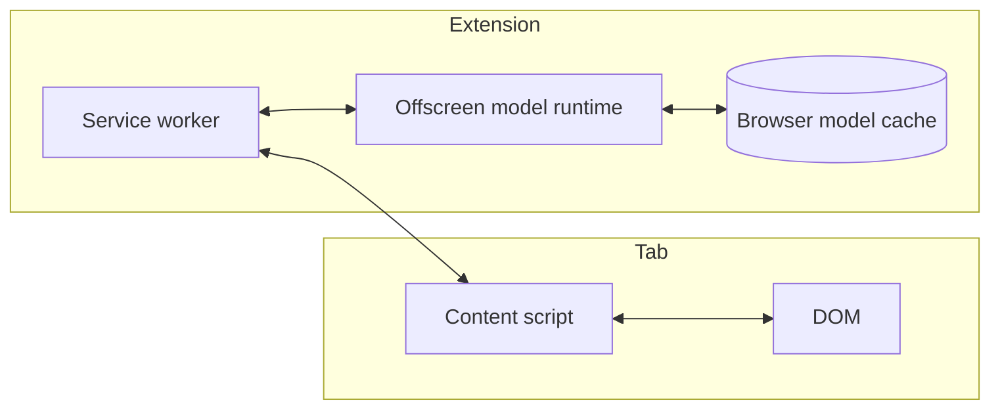
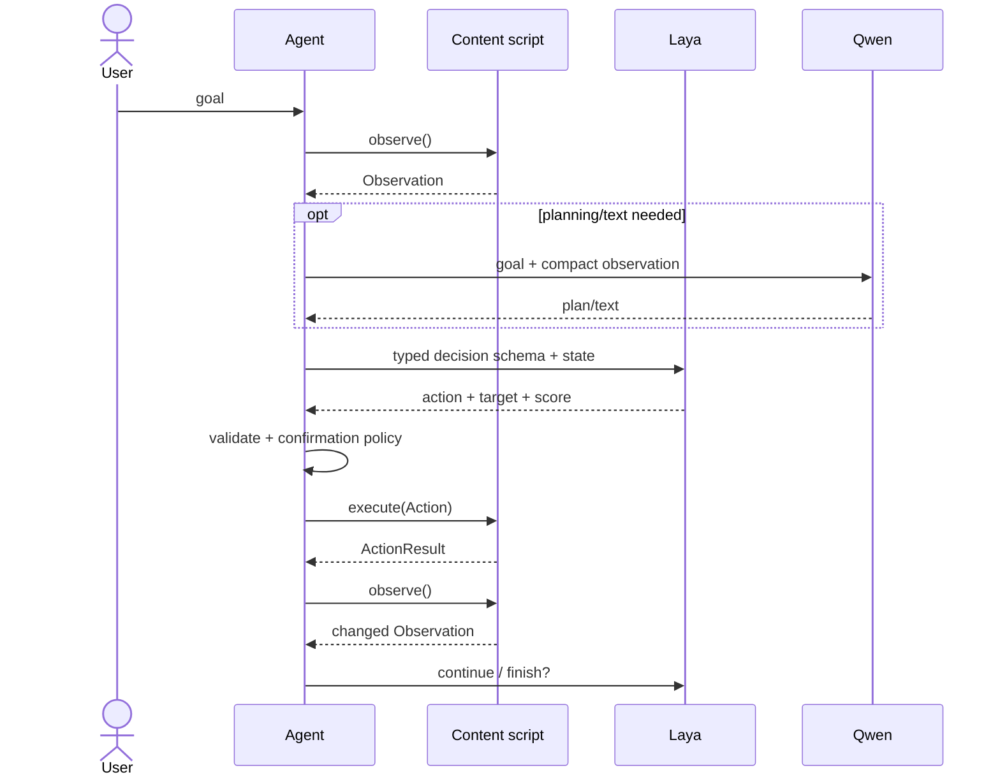
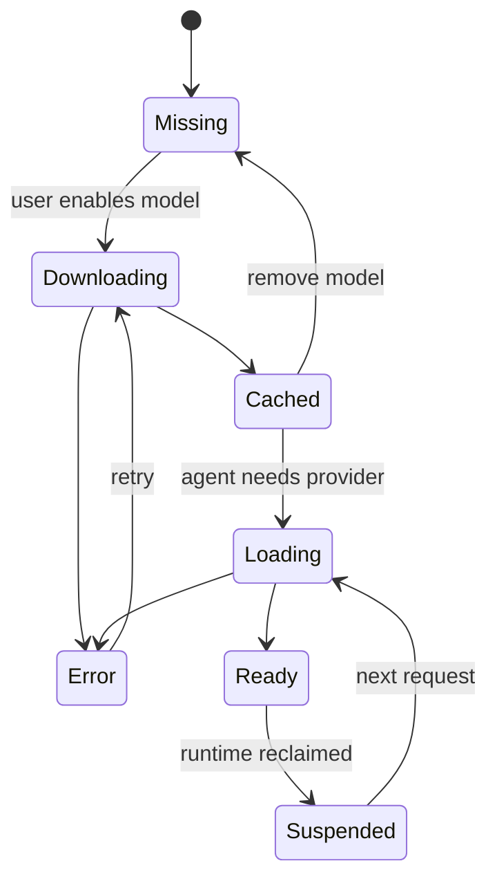

# Local Browser Agent specification

## Goal

Build a zero-backend browser agent that can operate arbitrary pages using models running inside Chromium. After the initial model download, ordinary operation must work offline. Model files are shared by the extension, not downloaded independently by every page.

## Non-goals for v1

- generated/evaluated JavaScript;
- arbitrary shell/native execution;
- bypassing site authentication or permissions;
- autonomous purchases, destructive actions, or credential submission without confirmation;
- pixel-only computer vision;
- a cloud inference fallback.

## System architecture



## Runtime boundaries



MV3 service workers may be suspended. Therefore model lifetime must not depend on a permanently alive service worker. The planned inference host is an offscreen extension document; model artifacts live in persistent browser storage/cache and can be restored without redownloading.

## Agent loop



The loop is bounded by a configurable action budget (v1 default: 10) and re-observes after every mutation/navigation.

## DOM representation

Do not send raw HTML. The content script creates stable per-observation refs for visible/relevant elements and records semantic properties. Example:

```json
{
  "url": "https://example.test/",
  "title": "Example",
  "nodes": [
    {"ref":"e1","role":"textbox","name":"Search","disabled":false},
    {"ref":"e2","role":"button","name":"Search","disabled":false}
  ]
}
```

Refs are valid only for the observation that created them. A DOM mutation/navigation invalidates them and forces re-observation.

## Model lifecycle



The first milestone should prove: install extension -> download models once -> disconnect network -> perform ten different DOM tasks successfully.

## Security model

Page content is untrusted input. It cannot change system policy, action schemas, confirmation rules, model URLs, extension permissions, or action budget. The executor never evaluates model-generated JavaScript.

Sensitive actions (credential submission, purchases, deletion, permission grants, sending externally visible messages) require explicit human confirmation in v1.

## Provider contracts

The architecture names capabilities, not model brands:

- `DecisionProvider.decide(input, schema) -> Decision`
- `TextProvider.generate(input) -> TextResult`
- `ModelManager.ensure(model) -> ModelHandle`

Laya and Qwen3-0.6B are the initial implementations. This keeps benchmarking/replacement cheap.

See [schemas.md](schemas.md) for canonical data contracts and [roadmap.md](roadmap.md) for implementation order.
